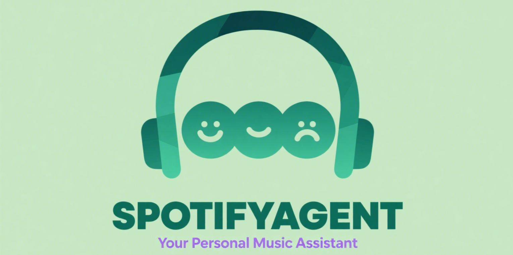

<div align="center">

# 🎵 SpotifyAgent 🤖



[](public/static/proposal.pdf)
</div>

https://github.com/user-attachments/assets/ef206c1d-2060-4090-87cc-aabcd0feb5b3


> 🌟 **Discover Your Next Favorite Song with AI-Powered Recommendations** 🌟

SpotifyAgent is an intelligent music recommendation assistant, integrating Spotify API and AI conversation systems. Users can interact with AI through natural language to receive personalized music recommendations and playback control services.

---

## 🚀 Key Features

- **🤖 AI Conversation Interface**: Support for text interactions with intelligent suggestions
- **🎵 Deep Spotify Integration**: Complete user authentication, playback control, and queue management
- **🔧 MCP Toolchain**: Model Context Protocol support with extensible tool ecosystem
- **😊 Mood-based Recommendations**: Personalized recommendations based on user mood and user personal Spotify profile.

---

## 🧠 Tech Stack

- **🧠 AI Models**: Qwen2.5-7B-Instruct for intelligent conversation
- **🎵 Spotify API**: For music playback and user data
- **🌐 Next.js**: Frontend framework
- **🐍 Python**: Backend services
- **🐳 Docker**: Containerization

This project demonstrates how to deeply integrate AI technology with music services to provide users with an intelligent music experience.

---

## 🛠️ Getting Started

1. ⚙️ Config env

**Important Security Notice**: Never commit your actual API keys to version control or Docker images. The example below shows placeholder values. For local development, create a `.env.local` file with your real keys, which is automatically ignored by git and Docker.

```bash
# Copy the example file and fill in your actual API keys

cp .env.local.example .env.local

# Then edit .env.local with your real API keys
```

Example `.env.local` content:

```bash
# qwen provider(default use)
DASHSCOPE_API_KEY=xxxxxxxxxxxxxxxxxxxxxxxxxxxxxxxxxxxxxxxxxxxxxxxxx
# openai provider
OPENAI_API_KEY=xxxxxxxxxxxxxxxxxxxxxxxxxxxxxxxxxxxxxxxxxxxxxxxxx

# Spotify API configuration
SPOTIFY_CLIENT_ID=xxxxxxxxxxxxxxxxxxxxxxxxxxxxxxxxxxxxxxxxxx
SPOTIFY_CLIENT_SECRET=xxxxxxxxxxxxxxxxxxxxxxxxxxxxxxxxxxxxxxxxxx
SPOTIFY_REDIRECT_URI=http://127.0.0.1:3000/api/auth/callback/spotify

# NextAuth configuration
NEXTAUTH_URL=http://127.0.0.1:3000
NEXTAUTH_SECRET=xxxxxxxxxxxxxxxxxxxxxxxxxxxxxxxxxxxxxxxxxxxxxxxxx

# Last.fm API configuration
LASTFM_API_KEY=xxxxxxxxxxxxxxxxxxxxxxxxxxxxxxxxxxxxxxxxxxxxxxxxx
LASTFM_API_SECRET=xxxxxxxxxxxxxxxxxxxxxxxxxxxxxxxxxxxxxxxxxxxxxxxxx
```

And prepare `spotify_mcp_server/.env`, the same with `.env.local`

Go [Bailian](https://bailian.console.aliyun.com/) to get `DASHSCOPE_API_KEY`, for `qwen2.5-7b-instruct` as LLM base.

Go [Spotify Doc](https://developer.spotify.com/documentation/web-api/tutorials/getting-started) to get `SPOTIFY_CLIENT_ID` and `SPOTIFY_CLIENT_SECRET`, and set `SPOTIFY_REDIRECT_URI` to `http://127.0.0.1:3000/api/auth/callback/spotify` in Spotify Dashboard.

Generate `NEXTAUTH_SECRET` with 

```bash
openssl rand -base64 32
```

Go [LastFm](https://www.last.fm/api/account/create) to get `LASTFM_API_KEY` and `LASTFM_API_SECRET`. More detail here in [pylast](https://github.com/pylast/pylast#getting-started)


Some python package also need to be installed.
`uv` is recommended to manage python package(powerful than `pip`), you can install it using the following command:
```bash
uv venv  # create a virtual environment
source .venv/bin/activate  # activate the virtual environment
```
run `uv sync` to install python package with `pyproject.toml`.


For MCP server, install `uv` following [official guidance](https://docs.astral.sh/uv/#installation).

For frontend, install `pnpm` following [official guidance](https://pnpm.io/installation)

```bash
uv sync       # install dependencies for MCP server
pnpm install  # install dependencies for frontend
pnpm run dev
```

---

## 🐳 Docker Deployment (more easy to use)

Make sure you've install Docker related packages.

Prepare the `.env.local` file.
```bash
cp .env.local.example .env.local
```

Pull and run the image.

```bash
docker compose up
```

