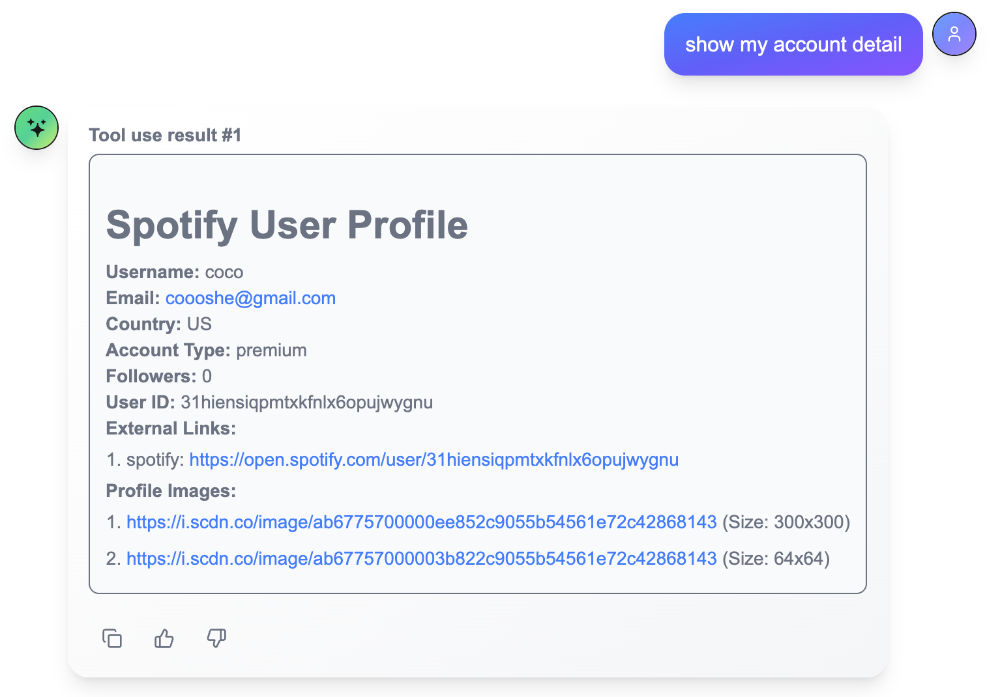
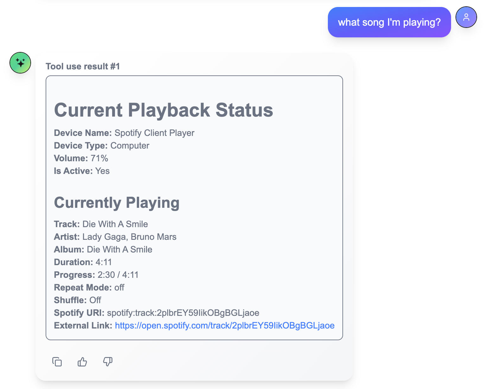
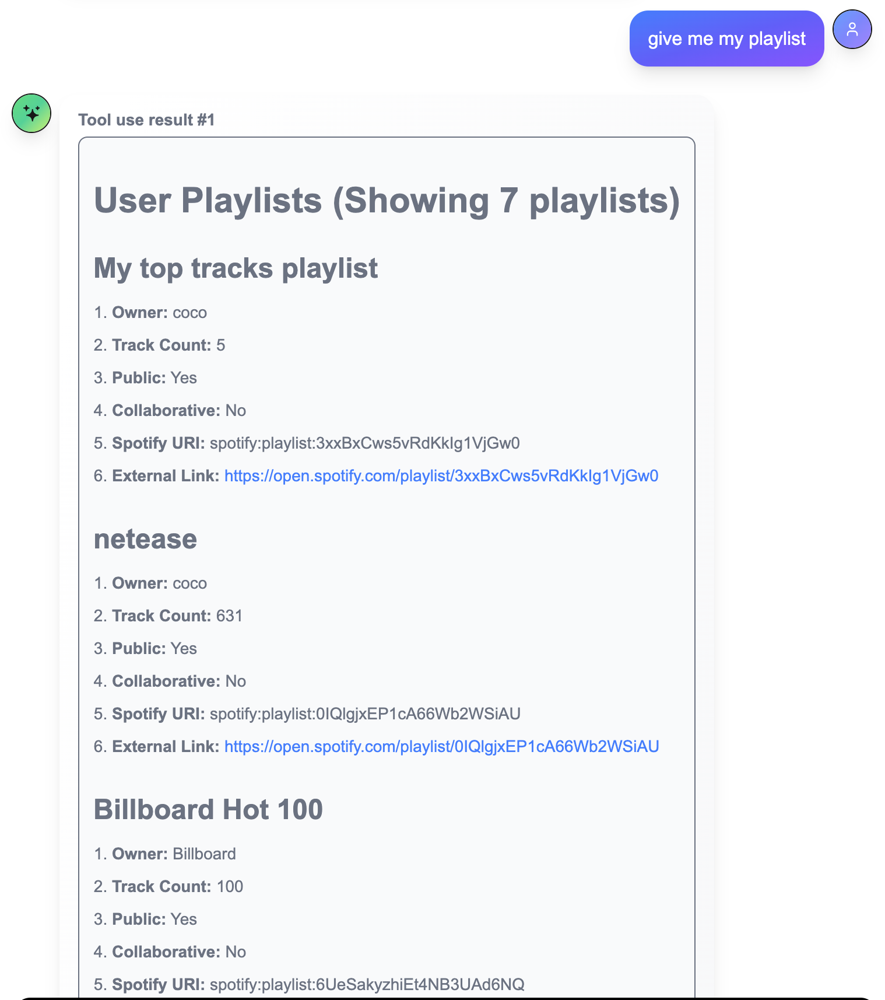
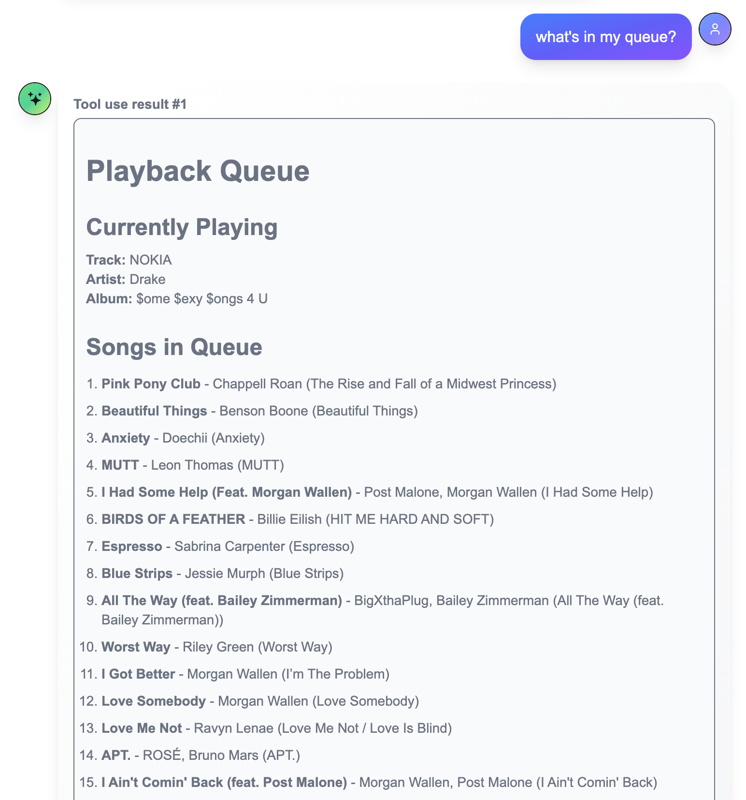
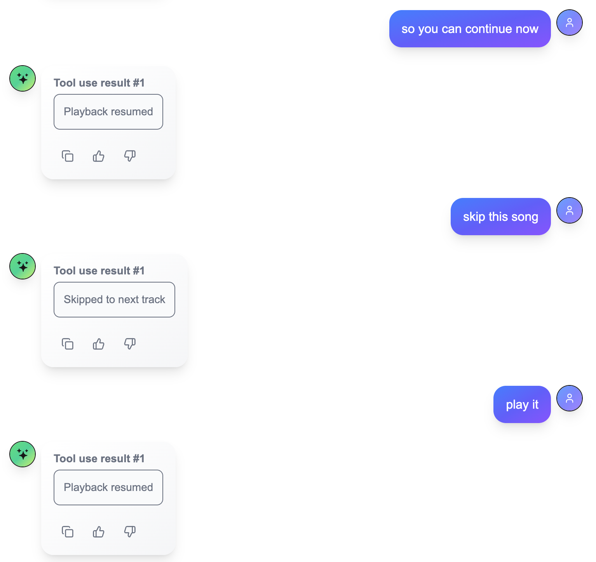
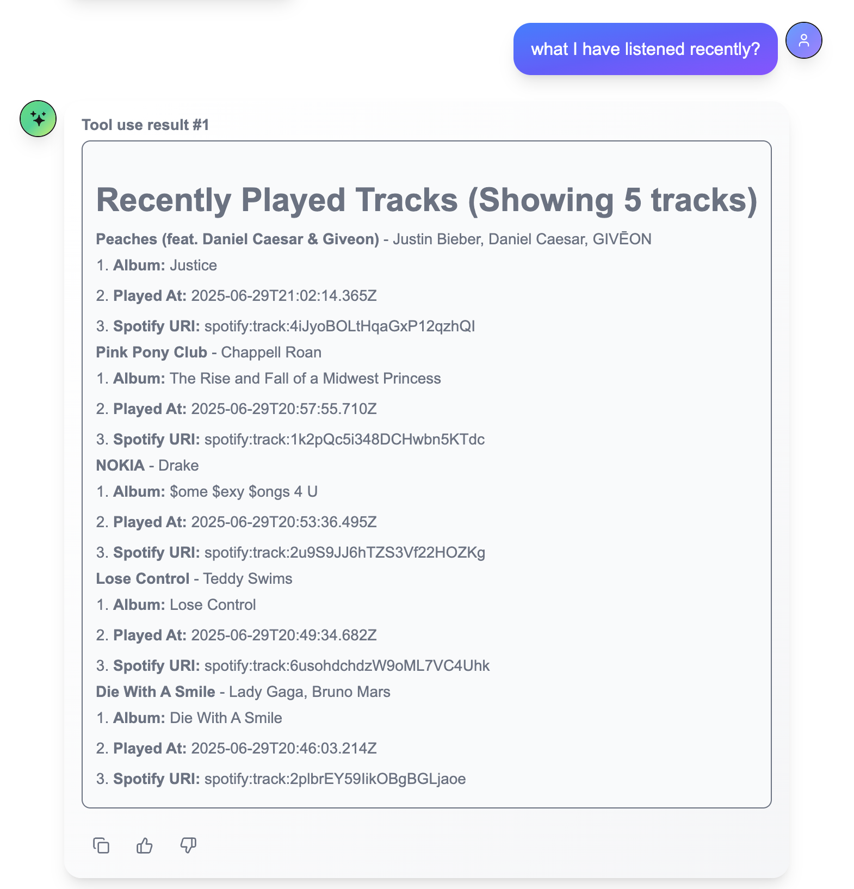
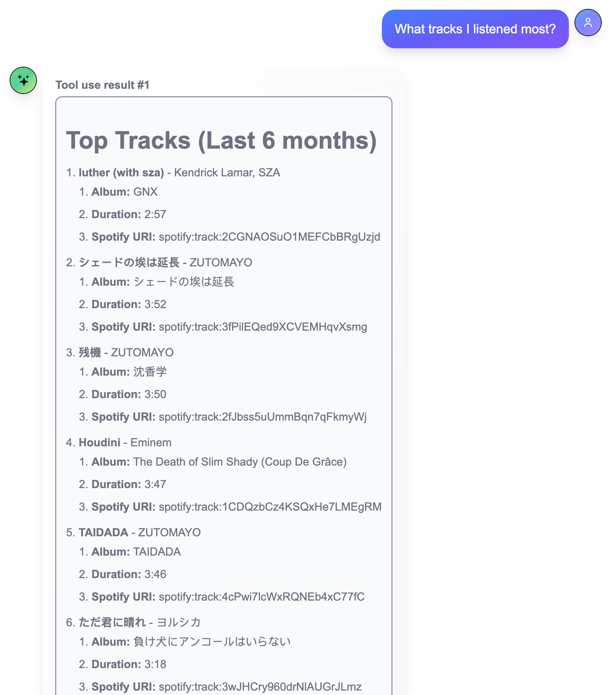
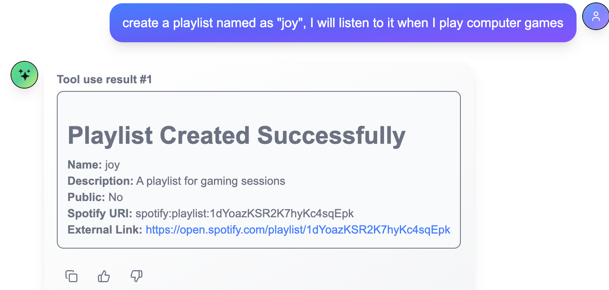
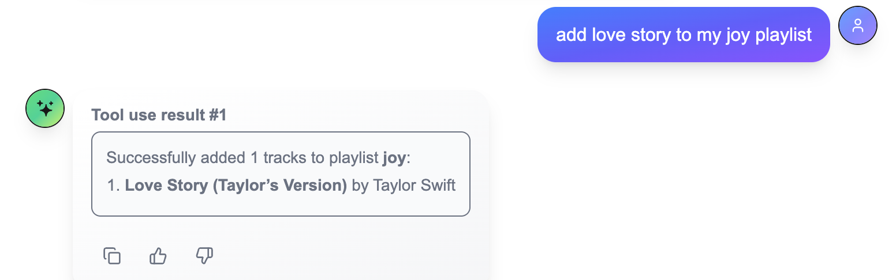
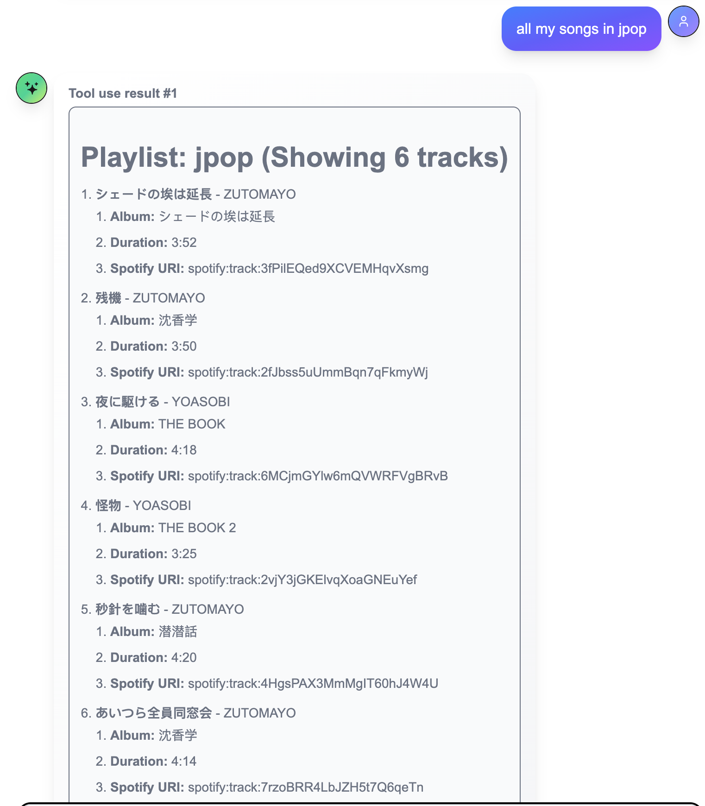

# Spotify_mcp_server

## Main Features

1. user profile

2. current playback info

3. my playlists

4. queue tracks

5. search tracks

6. playback control: pause, play, skip

7. recently played

8. most played

9. create playlist

10. manipulate playlist

11. get tracks in playlist

12. set 

